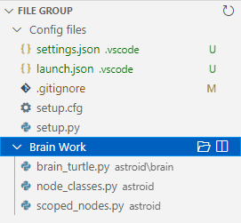

Open a group of files with 1 command or Key binding.

By definig one or more groups of file paths you can open together with 1 Key binding.

Select files in the File Explorer and apply a command script on the file paths.

# Extension Settings

* `fileGroup.groups`: Definition of the different groups. It is an object with the following fields:
    * the key for the group can have any name
    * the parameters for each group are
        * `files`: an array with the full file paths, OS versions

    A good location to store this is in the User `settings.json`. This will not influence your team members.

    If you store this in the WorkspaceFolder settings there are 2 cases:

    * you have opened 1 folder ==> it can be in `.vscode/settings.json`
    * you have opened a Multi Root Workspace ==> use the `name.code-workspace` file,<br/>
      because the loading needs to happen independent of a current file open

* `fileGroup.scripts`: Definition of the different scripts. It is an object with the following fields:
    * the key for the script can have any name
    * the parameters for each script are
        * `label`: (Optional) Label to use in the QuickPick list (default: script name)
        * `description`: (Optional) Description to use in the QuickPick list on the same line
        * `detail`: (Optional) Detail to use in the QuickPick list on a separate line
        * `interval`: (Optional) time interval between each command execution (in miliseconds)
        * `script`: Array of script steps, a step can process 0 or more files
            * `file`: (Optional) which file(s) should be handled<br/>
              it consists of 2 properties separated by `;`, `howMany;regex`<br/>
              _howMany_ can be `all` or a number,<br/>
              _regex_ (Optional) is a regular expression that is tested on the posix version of the file path (separator `/`). If the _regex_ is not given a value of `.*` is used, this matches every file.<br/>
              The default action after the file is used is that it is removed from the file list. If you want to **keep** the file(s) you can add `:keep` to the _howMany_ property, like `1:keep;\.x?html$` (use 1 HTML file and keep the file in the list)
            * `flags`: (Optional) regex flags used to match the file path (only `i` makes sense)
            * `command`: The command to execute
            * `args`: (Optional) The argument for the command.<br/>
              This can be any valid JSON: `object`, `array`, `string`, `number`, `boolean`.<br/>
              A string can contain [variables](https://code.visualstudio.com/docs/editor/variables-reference). The variables supported are `${fileBasename}`, `${fileBasenameNoExtension}`, `${fileExtname}`, `${relativeFile}`, `${relativeFileDirname}`, `${file}`, `${fileDirname}`, `${fileWorkspaceFolder}`.

# How to use

An example `settings.json`:

```json
    "fileGroup.groups": {
      "1": {
        "files": [
          "C:\\Projects\\project1\\Tutorial.md",
          "C:\\Projects\\project2\\API.md"
        ]
      },
      "2": {
        "files": [
          "C:\\Projects\\project2\\Tutorial.md",
          "C:\\Projects\\project3\\Reference.md"
        ]
      }
```

# Keybindings

The command `fileGroup.openGroup` can be bind to a Key combo to open a named group in a possible Column, number 1 to 9 (split editor).

The `args` property is an object with the fields:

* `group`: the name of the group to open
* `column`: [Optional column](https://code.visualstudio.com/api/references/vscode-api#ViewColumn) to open the files in (default: current Active Column)

If you choose the Column Beside (-2) each file will be opened in a separate Column. If you choose a Column that does not exist yet the files will be put in separate groups until there is a group with that Column number.

An eample keybinding:

```json
  {
    "key": "ctrl+shift+f1", // or any other combo
    "command": "fileGroup.openGroup",
    "args": { "group": "1", "column": 2 }
  }
```

## Predefined keybindings

For groups "1", "2", .... , "9", "0" there is a predefined key binding.

* for Windows and Linux it is `Ctrl+Alt+number`, like `Ctrl+Alt+3`
* for macOS it is `Cmd+Alt+number`, like `Cmd+Alt+3`

The files will be opened in the current Active Column.

## Special language keyboards

Certain language keyboards use the `Ctrl+Alt+number` key combo for special characters.

You can remove the predefined keybindings and define new ones yourself.

Add this to the bottom of your `keybindings.json`

```
{ "command": "-fileGroup.openGroup", "key": "ctrl+alt+1"},
{ "command": "fileGroup.openGroup", "args": { "group": "1" }, "key": "ctrl+alt+shift+1" }
```

Repeat this for the other keys `2...9,0`

For macOS replace `Ctrl` with `Cmd`.

## File Group View

In the Explorer Bar is a View that shows the groups found in the setting `fileGroup.groups`.



You can open the group with the buttons on the group item and with the context menu of the group item.

If you have modified the setting press the **Refresh** button at the top of the File Group view.

To Show/Hide the View use the `...` menu at the top of the Explorer Bar.

# Scripts on File Groups

When you select a number of files in the File Explorer you have the command **Open File Group with a script** in the context menu (right click). Only if there are scripts defined.

You choose a defined script from a Quick Pick list.

Together with the file list a command sequence is constructed and executed by the extension [multi-command](https://marketplace.visualstudio.com/items?itemName=ryuta46.multi-command).

A very usefull extension is [HTML Related Links](https://marketplace.visualstudio.com/items?itemName=rioj7.html-related-links). It contains a command that allows you to open a file with a command. (`htmlRelatedLinks.openFile`).

Both extensions are set as dependencies and will be installed if you don't have them yet. HTML Related Links creates a view in the Explorer bar. You can disable it with a setting: set both `html-related-links.alwaysShow` and `html-related-links.showIfHTML` to `false`.

An example: If I select HTML, CSS and JavaScript files I can open them each in a separate group/editor:

```
  "fileGroup.scripts": {
    "open side by side (HTML,CSS,*)": {
      "script": [
        { "command": "workbench.action.focusFirstEditorGroup" },
        { "file": "all;\\.x?html$",
          "command": "htmlRelatedLinks.openFile",
          "args": { "file": "${file}"}
        },
        { "command": "workbench.action.focusSecondEditorGroup" },
        { "file": "all;\\.css$",
          "command": "htmlRelatedLinks.openFile",
          "args": { "file": "${file}"}
        },
        { "command": "workbench.action.focusThirdEditorGroup" },
        { "file": "all",
          "command": "htmlRelatedLinks.openFile",
          "args": { "file": "${file}"}
        }
      ],
      "interval": 500
    }
  }
```

We have to set an `interval` because it takes time to load the file.

# Release Notes

### v1.0.0
* File Group View

### v0.3.0
* Scripts for file groups

# TODO

* Add files to a group with the Editor context menu and File Explorer context menu
* Remove files from a group with the Editor context menu and File Explorer context menu
* a quick pick list of the currently defined groups with label/detail/description
* support relative file paths, but which workspaceFolder to use